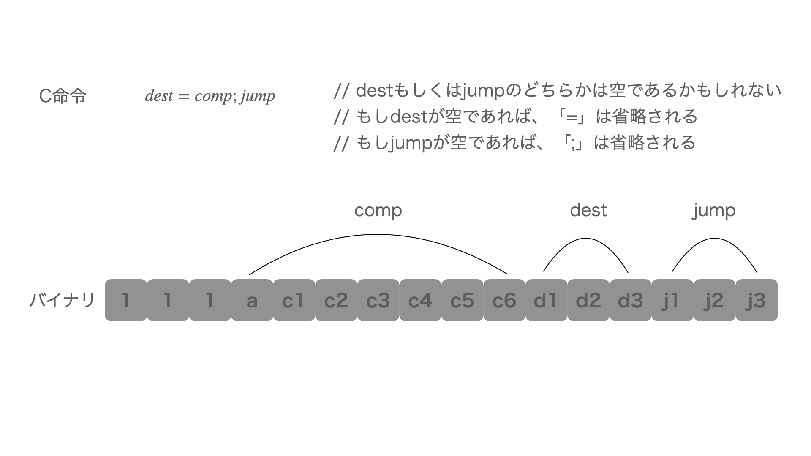

# Chapter04-順序回路

## インデックス
* [概要](#overview)
* [機械語](#machine-language)
* [メモリ](#memory)
* [プロセッサ](#processor)
* [レジスタ](#register)
* [アセンブリ](#assembly)
* [算術演算と論理演算](#arithmetic-and-logical-operations)
* [メモリアクセス](#memory-access)
* [分岐命令](branch-instruction)
* [Hackの仕様](#hack-method)
* [Hackメモリアドレス空間](#hack-memory-address-space)
* [Hackレジスタ](#hack-register)
* [Hack機械語の例](#hack-example)
* [A命令](#a-order)
* [C命令](#c-order)
* [シンボル](#symbol)
* [実装リファレンス](#reference)

<a id="overview"></a>

## 概要
* コンピュータを **構造的** な視点から説明するには、そのハードウェアのプラットフォームを提示し、それが下位レベルの回路からどのように構築されているかを説明すればよい.
* コンピュータを **抽象的** な視点から説明するには、その **機械語** の仕様を示し、その機械語によって何ができるかを明らかにすればよい.
* 機械語の仕様は、合意に基づく形式に従い、低水準なプログラムを一連の機械語指令としてコード化できるように設計されている. この命令を用いると、算術計算や論理計算、メモリからのフェッチ（データの読み込み）やメモリへのデータ保存、レジスタ間のデータ移動、ブーリアン値の条件テスト、などをプログラマはプロセッサに実行させることができる.
* 機械語が目標とすることは、対象とするハードウェア上で直接実行できること、そのハードウェア全体を制御できることである. 満たさなければならない唯一の基本的要求は、ハードウェア上で直接実行できることである.
* 機械語においてハードウェアとソフトウェアが交わり、機械語においてプログラマの抽象的思考（これは記号命令によって表される）がシリコン上で実行される物理的操作に変換される.
* 機械語を説明するには、3つの抽象化についてだけ考えればよい. **メモリ**、**プロセッサ**、**レジスタ** である.
<br />

<a id="machine-language"></a>

## [機械語](https://e-words.jp/w/%E6%A9%9F%E6%A2%B0%E8%AA%9E.html)
* 機械語は、仕様によって決められた形式に従い、プロセッサとレジスタを用いてメモリを操作するように設計されている.
* コンピュータのマイクロプロセッサ（CPU/MPU）が直接解釈・実行できる命令コードの体系.
* 0と1を並べたビット列（バイナリコード）として表され、人間が直に読み書きしやすい形式ではない.
* 機械語は、プロセッサに直接命令を与える言語であるため、プロセッサの持つすべての機能を利用することができる.
* どのようなプログラミング言語で記述されたプログラムであっても、ソフトウェアによる変換や調整を経て、最終的には機械語のプログラムとしてプロセッサに渡され実行される.
<br />

<a id="memory"></a>

## メモリ
* コンピュータでデータや命令を保存するハードウェアデバイス.
* ある固定幅のセル（**ワード** や **ロケーション** とも呼ばれる）が連続して並んでおり、それぞれがユニークな **アドレス** を持つ.
* 個々のワード（データもしくは命令を表す）は、アドレスによって指定される.
<br />

<a id="processor"></a>

## プロセッサ
* **中央演算装置（Central Processing Unit）** や **CPU** と呼ばれ、仕様で決められた命令セットを実行する.
* 命令セットには、算術演算と論理演算、メモリアクセス演算、制御演算（ブランチ）などが含まれる. 演算のオペランド（演算の対象）は、レジスタやメモリから取り出されるバイナリデータである.
* 演算の結果もレジスタもしくはメモリに格納することができる.
<br />

<a id="register"></a>

## [レジスタ](https://e-words.jp/w/%E3%83%AC%E3%82%B8%E3%82%B9%E3%82%BF.html)
* マイクロプロセッサ（CPU/MPU）内部にある、演算や実行状態の保持に用いる記憶素子.
* メモリへのアクセスは時間のかかる操作であり、毎回メモリから読み出し/書き込みを行っていると処理時間が遅くなる. そのため、プロセッサ内部にレジスタを置くことで、高速にアクセスできる.
* 各レジスタは、1つの値だけを保持できるようになっている.
<br />

<a id="assembly"></a>

## アセンブリ
* 機械語（バイナリコード）のプログラムは、一連の符号化された命令である. それだけでは判読できないため、通常バイナリコードとニーモニックの両方を用いて記述される.
* **ニーモニック** は、記号や英単語で記述され、その名前によって何を行う命令かを把握することができる. たとえば、「1010という命令コードはニーモニックで表すとADDとする」といったことを設計者は決めることができる.
* この記号（ニーモニック）による抽象化をさらに進めると、記号による表記は読むためだけでなく、プログラムを書くためにも用いることができる. つまり、バイナリコードで書く代わりに、記号によるコマンドを用いてプログラムを書くことができる.
* この記号による表記は、**アセンブリ言語** または、単に **アセンブリ** と呼ばれ、アセンブリから機械語であるバイナリコードへ変換するプログラムは **アセンブラ** と呼ばれる.
* コンピュータが異なれば、CPUの命令セット、レジスタの数や種類などが違うため、機械語が異なる. そのため、アセンブリの構文ルールも異なる. ただし、どのような機械語であれ、同じような一般的なコマンドをサポートしている.
<br />

<a id="arithmetic-and-logical-operations"></a>

## 算術演算と論理演算
* どのようなコンピュータであれ、加算/減算のような算術演算や、ビットシフト・ビット単位の否定のような論理演算を実行できることが求められる.
* 一般的なアセンブリのシンタックスで書かれた例は以下のようになる.
	```
	ADD R2 R1 R3	// R2 <- R1 + R3（R1、R2、R3はレジスタ）
	ADD R2 R1 foo	// R2 <- R1 + foo（fooはユーザが定義したラベルであり、そのラベルが指す位置にあるメモリの値）

	AND R1 R1 R2	// R1 <- R1とR2のビット単位AND
	```
<br />

<a id="memory-access"></a>

## メモリアクセス
* メモリアクセスを行う場合は2つの場合が考えられる.
	1. 算術演算や論理演算を行う.
	2. メモリに対して明示的に読み込み（load）や格納（store）を行う.
* メモリアクセスを行うコマンドは、**アドレッシングモード** を用いており、アドレッシングモードにはいくつかの種類が存在する.
* 直接アドレッシング
	* メモリのアドレスを指定する最も一般的な方法.
	* 直接アドレスを指定する、もしくはシンボルを用いて特定のアドレスを参照する.
	* 例
		```
		LOAD R1 67	// R1 <- Memory[67]

		// barの参照する値が67である場合
		LOAD R1 bar	// R1 <- bar <- Memory[67]
		```
* イミディエイトアドレッシング
	* 定数を読み込むために用いられる.
	* 命令中に現れる数値領域をアドレスとして扱う代わりに、その値をそのままレジスタに読み込む.
	* 例
		```
		LOADI R1 67	// R1 <- 67
		```
* 間接アドレッシング
	* ポインタを扱うのに用いられる.
	* 例
		```
		// x = foo[j] もしくは x = *(foo+j) の変換
		ADD R1 foo j	// R1 <- foo + j
		LOAD R2 R1		// R2 <- Memory[R1]
		STR R2 x		// x <- R2
		```
<br />

<a id="branch-instruction"></a>

## 分岐命令
* 分岐命令には、以下のようなものがある.
	* 反復
		* ループ処理の開始位置に戻る.
	* 条件分岐
		* もし条件がfasleであれば、「if-then節」の後ろにある位置に移動する.
	* サブルーチン呼び出し
		* あるコードセグメントの最初のコマンドに移動する.
		* [サブルーチン](https://e-words.jp/w/%E3%82%B5%E3%83%96%E3%83%AB%E3%83%BC%E3%83%81%E3%83%B3.html)とは、コンピュータプログラムの中で特定の機能や処理をひとまとまりの集合として定義し、他の箇所から呼び出して実行できるようにしたもの.
* 高水準/低水準における分岐ロジック
	* 高水準
		```
		// whileループ
		while (R1 >= 0) {
			code segment 1
		}
		code segment 2
		```
	* 低水準
		```
		// 一般的な変換
		beginWhile:
			JNG R1 endWhile		// もしR1<0であればendWhileへ移動
			// 「code segment 1」の変換コードはここにくる
			JMP beginWhile		// beginWhileへ移動
		endWhile:
			// 「code segment 2」の変換コードはここにくる
		```
		* 「JMP beginWhile」のような **無条件分岐** を行うコマンドは、目的とする位置のアドレスだけを指定する.
		* 「JNG R1 endWhile」のような **条件分岐** では、ブール条件も何らかの方法で指定しなければならない.
<br />

<a id="hack-method"></a>

## Hackの仕様
* Hackコンピュータは、ノイマン型のプラットフォームである. ノイマン型コンピュータとは、ストアドプログラム方式（メモリ上にプログラムをロードし、CPUそれを読み取りながら実行する）のコンピュータである.
* 16ビットのマシンであり、CPU、メモリモジュール、メモリマップドI/Oデバイスを備える. 
* メモリモジュールには、命令用とデータ用のメモリが離れた場所に存在する.
* メモリマップドI/Oデバイスは、スクリーン用とキーボード用の2つがある.
<br />

<a id="hack-memory-address-space"></a>

## Hackメモリアドレス空間
* Hackプログラマは、2つの異なるアドレス空間があることを知る必要がある. **命令メモリ** と **データメモリ** である. 両方のメモリは、共に16ビット幅であり、15ビットのアドレス空間を持つ.
* CPUは、命令メモリに存在するプログラムだけを実行することができる. 命令メモリは、読み込み専用メモリ（ROM）であり、プログラムの読み込みには外部の仕組みを利用する.
* 命令メモリの読み込みには、たとえば、必要なプログラムがすでに書き込まれたROM回路を用いることによって実現できる. これは、ゲーム機のカセットを入れ替えるのと同じ仕組みである.
<br />

<a id="hack-register"></a>

## Hackレジスタ
* Hackプログラマは、DとAという2つの16ビットレジスタがあることを知る必要がある. これらのレジスタは、算術演算や論理演算で用いられる.
* Dはデータ値だけを保持するが、Aはデータレジスタとアドレスレジスタの二役を担う. つまり、命令の使われる状況によって、Aの中身はデータ値と解釈されたり、データメモリ（または命令メモリ）のアドレスとして解釈されたりする.
* Aレジスタがデータメモリへ直接アクセスされる場合
	* Hackの命令は16ビット幅であり、アドレスの指定には15ビット必要であるから、命令コードとアドレスを1つの命令に押し込むことは不可能である.<br>
	-> Hack言語では、メモリアクセス命令を行う場合、"M"というラベル付けされたメモリ位置を明確に指定することなく操作しなければならない.
	* このアドレスを解決するためには、「Mが参照するメモリのワードは、現在のAレジスタの値をアドレスとするメモリワードの値である」ということを"決まり事"とすることで対処する.
	* 「D = Memory[516] - 1」のような操作を行いたい場合、以下のようにする.
		1. Aレジスタに516を設定する命令を実行.
		2. 「D = M - 1」を行う命令を実行.
* Aレジスタが命令メモリへ直接アクセスされる場合
	* Hackのジャンプ命令は、特定のアドレスを指定することはしない. その代わりに、「どのようなジャンプ命令であっても、Aレジスタの値をアドレスとするメモリワードの位置へ移動する」ということを"決まり事"とする.
	* 「goto 35」のような操作を行いたい場合、以下のようにする.
		1. Aレジスタに35を設定する命令を実行.
		2. gotoコマンドを実行（アドレスを指定せずに実行する）.
<br />

<a id="hack-example"></a>

## Hack機械語の例
* C言語
	```c
	// 1+...+100の和を求める
	int	i = 1;
	int	sum = 0;
	while (i <= 100) {
		sum += i;
		i++;
	}
	```
* Hack機械語
	```
			@i		// iはメモリの特定の場所を参照している
			M=1		// i=1
			@sum	// sumはメモリの特定の場所を参照している
			M=0		// sum=0
	(LOOP)
			@i
			D=M		// D=i
			@100
			D=D-A	// D=i-100
			@END
			D;JGT	// もし（i-100)>0ならばENDへ移動
			@i
			D=M		// D=i
			@sum
			M=D+M	// sum=sum+i
			@i
			M=M+1	// i=i+1
			@LOOP
			0;JMP	// LOOPへ移動
	(END)
			@END
			0;JMP	// 無限ループ
	```
	* 「@value」は、valueの値をAレジスタに格納するためのコマンド. valueには、数値もしくは数値を表すシンボルのどちらかである.
	* メモリ操作を伴う命令は、どのような命令であれ、Hackコマンドを2回実行する必要があることに注意. 1つ目は操作を行いたいアドレスを指定するためのコマンドであり、2つ目は実際に行いたい操作の命令を指定するためのコマンドである.
	* 最後にある無限ループは、Hackプログラムを"終了させる"標準的な方法である.
* Hack機械語は、2つの一般的な命令から構成される. **アドレス命令** と **計算命令** である. アドレス命令は「A命令」、計算命令は「C命令」とも呼ばれる.
<br />

<a id="a-order"></a>

## A命令
* A命令は、Aレジスタに15ビットの値を設定するために用いられる. この命令を用いることで、特定の値をAレジスタに格納することができる.
* たとえば、$@5$という命令は、「0000000000000101」と等しく、5の2進数で表記した値をAレジスタに保存することができる.
* A命令は3つの用途で使用することができる.
	* Aレジスタを用いて定数を代入する.
	* メモリ操作を行う.
		* あらかじめAレジスタにメモリのアドレスを設定することで、その後に続くC命令において、Aレジスタで指定したメモリ位置にあるデータを操作することができる.
	* 移動命令.
		* あらかじめAレジスタに移動先のメモリアドレスを読み込むことで、その後に続く移動を行うためのC命令（jump命令）を用いて、次に実行する命令の位置を移動することができる.
<br />

<a id="c-order"></a>

## C命令
* C命令の仕様は、以下の3つの質問に答えることができるように決められている.
	* 何を計算するか？
	* 計算した結果をどこに格納するか？
	* 次に何をするか？
* C命令は、A命令と一緒に用いることで、コンピュータで行うすべての命令を実行することができる.



* C命令の一番左に位置するビットは1であり、その次の2つのビットは使用しない.
* 残りのビットは、3つの領域から構成され、各領域はcomp、dest、jumpに対応する.
* $dest=comp;jump$という命令は、$comp$領域がALUに何を計算するかを命令し、その計算された値（ALUの出力）を格納する場所が$dest$領域によって指定される. $jump$領域は、移動条件を、つまり、次にどのコマンドを取り出して実行するかを指定する.
* comp領域の仕様
	* HackのALUは、D、A、Mレジスタ（MはMemory[A]を意味する）に対して仕様で決められた関数を計算するように設計されている.
	* 計算を行う関数は、命令の$comp$領域にあるaビット1つとcビット6つによって決定される.
	* この計7ビットの配列は、128通りの異なる関数を指定することができるが、Hack機械語の仕様は以下の28個の関数を使用するように定義されている.
		| compニーモニック（a=0のとき） | c1 | c2 | c3 | c4 | c5 | c6 | compニーモニック（a=1のとき） |
		| ------------------------- | -- | -- | -- | -- | -- | -- | ------------------------- |
		| 0							| 1 | 0 | 1 | 0 | 1 | 0 | |
		| 1 						| 1 | 1 | 1 | 1 | 1 | 1 | |
		| -1						| 1 | 1 | 1 | 0 | 1 | 0 | |
		| D							| 0 | 0 | 1 | 1 | 0 | 0 | |
		| A							| 1 | 1 | 0 | 0 | 0 | 0 | M |
		| !D						| 0 | 0 | 1 | 1 | 0 | 1 | |
		| !A						| 1 | 1 | 0 | 0 | 0 | 1 | !M |
		| -D						| 0 | 0 | 1 | 1 | 1 | 1 | |
		| -A						| 1 | 1 | 0 | 0 | 1 | 1 | -M |
		| D + 1						| 0 | 1 | 1 | 1 | 1 | 1 | |
		| A + 1						| 1 | 1 | 0 | 1 | 1 | 1 | M + 1 |
		| D - 1						| 0 | 0 | 1 | 1 | 1 | 0 | |
		| A - 1						| 1 | 1 | 0 | 0 | 1 | 0 | M - 1 |
		| D + A						| 0 | 0 | 0 | 0 | 1 | 0 | D + M |
		| D - A						| 0 | 1 | 0 | 0 | 1 | 1 | D - M |
		| A - D						| 0 | 0 | 0 | 1 | 1 | 1 | M - D |
		| D & A						| 0 | 0 | 0 | 0 | 0 | 0 | D & M |
		| D | A						| 0 | 1 | 0 | 1 | 0 | 1 | D | M |
	* たとえば、「D-1（現在のDレジスタの値から1を引く）」をALUに計算させたい場合、「111(0001110)000000」という命令を用いればよい.
* dest領域の仕様
	* C命令の$comp$領域で計算された値は、3ビットの$dest$領域で指定された値に応じて、対応する場所に保存される.
	* d1ビットはAレジスタに保存するかどうか、d2ビットはDレジスタに保存するかどうか、d3ビットはM（Memory[A]）に保存するかどうか、を指定する.

	| ニーモニック | d1 | d2 | d3 | 保存先（計算された値を格納する場所） |
	| ---------- | -- | -- | -- | ------------------------------ |
	| null       | 0  | 0  | 0  | 値はどこにも保存されない           |
	| M          | 0  | 0  | 1  | Memory[A]（メモリ中のアドレスがAの値の場所） |
	| D          | 0  | 1  | 0  | Dレジスタ                       |
	| MD         | 0  | 1  | 1  | Memory[A]とDレジスタ            |
	| A          | 1  | 0  | 0  | Aレジスタ                       |
	| AM         | 1  | 0  | 1  | AレジスタとMemory[A]            |
	| AD         | 1  | 1  | 0  | AレジスタとDレジスタ             |
	| AMD        | 1  | 1  | 1  | AレジスタとMemory[A]とDレジスタ   |
	
	* たとえば、Memory[7]の値を1だけインクリメントし、その結果をDレジスタに保存する場合、以下のようになる.
		```
		0000 0000 0000 0111		// @7
		1111 1101 1101 1000		// MD=M+1
		```
* jump領域の仕様
	* C命令の$jump$領域は、「次に何を行うか」を指定する. それには以下の2つの可能性がある.
		* プログラムの次の命令をフェッチし実行する（標準的な動作）.
		* プログラムのどこか他の場所に位置する命令をフェッチし実行する. この場合、移動したいアドレスは、あらかじめAレジスタに設定されている.
	* $jump$領域にある3つのjビットとALUの出力値に従って、移動するかどうかが決定される.
	* j1ビットはALUの計算結果の値が負の場合に移動することを指定、j2ビットは0の場合に移動することを指定、j3ビットは正の場合に移動することを指定する.

	| ニーモニック | d1 | d2 | d3 | 条件式 |
	| ---------- | -- | -- | -- | ----- |
	| null       | 0  | 0  | 0  | No jump |
	| JGT        | 0  | 0  | 1  | If out > 0 jump |
	| JEQ        | 0  | 1  | 0  | If out = 0 jump |
	| JGE        | 0  | 1  | 1  | If out >= 0 jump |
	| JLT        | 1  | 0  | 0  | If out < 0 jump |
	| JNE        | 1  | 0  | 1  | If out <= 0 jump |
	| JLE        | 1  | 1  | 0  | If out != 0 jump |
	| JMP        | 1  | 1  | 1  | Jump |

	* Memory[3]=5の時に100で指定された命令を実行し、それ以外の時に200で指定された命令を実行する場合以下のようになる.
		* ロジック
			```
			If Memory[3]=5 then goto 100
			else goto 200
			```
		* 実装
			```
			@3
			D=M		// D=Memory[3]
			@5
			D=D-A	// D=D-5
			@100
			D;JEQ	// If D=0 goto 100
			@200
			0;JMP	// Goto 200
			```
			* 「0;JMP」は、無条件で移動するための命令である.
* Aレジスタの衝突
	* Hackプログラマは、Aレジスタを使用するにあたって、以下のどちらかの目的で使用することができる.
		* C命令においてデータメモリの位置を指定する（これにはMを伴う）.
		* C命令において命令メモリの位置を指定する（これにはjumpを伴う）.
	* 上記より、Aレジスタを使用する場合、移動を伴うC命令（jビットが0でない場合）においてはMを参照すべきでない（その逆も同様）.
<br />

<a id="symbol"></a>

## シンボル
* アセンブラによるコマンドは、定数もしくは **シンボル** を用いて、メモリ位置（アドレス）を参照することができる.
* シンボルは、アセンブリプログラムにおいて以下の3つの方法で用いられる.
	* 定義済みシンボル
	* ラベルシンボル
	* 変数シンボル
* 定義済みシンボル
	* RAMアドレスの特別なものについては、どのようなアセンブリプログラムからも以下に示す定義済みシンボルを用いて参照することができる.
	* 仮想レジスタ
		* アセンブラによるプログラミングを単純化するために、R0~R15までのシンボルがRAMアドレスの0~15をそれぞれ参照するように、あらかじめ定義されている.
	* 定義済みポインタ
		* SP、LCL、ARG、THISというシンボルは、RAMアドレスの0~3それぞれ参照するように定義されている. アドレスの2番目の位置は、R2もしくはARGというシンボル名で参照することができる.
	* 入出力ポインタ（I/Oポインタ）
		* SCREENとKBDというシンボルは、RAMアドレスの16834（0x4000）と24576（0x6000）をそれぞれ参照するように定義されている. これらのアドレスは、スクリーンとキーボードのメモリマップにおけるベースアドレスを示す.
* ラベルシンボル
	* ユーザが定義するシンボルであり、gotoコマンドの行き先のラベルとして用いられる. このシンボルは、「"(Xxx)"」という形式のコマンドで宣言される. このコマンドにより、Xxxというシンボルが定義される. そのシンボルの値は、そのシンボルが定義された場所の次のコマンドの（命令メモリ中における）アドレスを表す.
* 変数シンボル
	* ユーザが定義したシンボルの中で、アセンブリプログラムで事前に定義されておらず、かつ「"(Xxx)"」というコマンドによってどこにも定義されていない場合（定義済みシンボルでもラベルシンボルでもない場合）、それは変数として扱われる. このシンボルは、アセンブラによって一意のメモリアドレスが与えられる. このアドレスは、16（0x0010）から始まる.
<br />

<a id="reference"></a>

## 実装リファレンス
* [コンピュータシステムの理論と実装の1〜5章のハードウェアを実装しました（ネタバレ注意）](https://nihemak.hatenablog.com/entry/2019/04/28/150541#Not)
* [ikenox](https://github.com/ikenox/nand2tetris)
